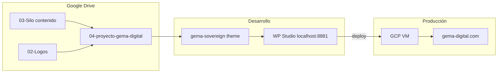

# Arquitectura del proyecto web

## Visión

## Capas

### 1. Contenido (fuente de verdad editorial)

- 29 carpetas numeradas con PDF/gdoc por página
- `base_de_datos_master.csv` — SEO Yoast
- `gema-menus.cvs` — navegación e interlinks
- Stitch HTML — UI Sovereign 4.0

### 2. Identidad (este repo — `brand/`)

- Tokens CSS listos para `theme.json` y Tailwind
- SVG conceptuales Fase 1 (refinar vs PNG oficiales)

### 3. Presentación (WordPress)

- Tema hijo soberano: marketing site completo
- Sin mezclar lógica ERP en WP (ERP vive en Supabase — Fase 3)

### 4. Producto ERP (futuro)

- Supabase PostgreSQL multi-tenant
- Frontend separado o área `/app` — fuera del alcance inmediato del sitio WP

## Mapa de páginas (resumen)

| Silo | Ejemplos slug |
|------|----------------|
| Core | `/`, `suscripciones`, `prueba-gratis`, `nosotros` |
| IA | `ia/brainstore`, `ia/agentes-autonomos`, `ia/observabilidad` |
| Tecnología | `tecnologia/conexion-bancaria`, `tecnologia/pasarela-pagos` |
| Impuestos | `impuestos/arca-fiscal` |
| Sectores | `sectores`, `sectores/gema-negocios`, `sectores/agroindustria` |
| Integraciones | `integraciones/mercado-libre` |
| Competencia | `competencia/tango`, `competencia/odoo`, … |
| Servicios | `servicios/fde-engineering` |
| Contenido | `blog`, `atencion-personalizada` |

## Decisiones de arquitecto

1. **Un solo tema hijo** con variantes `.theme-gema`, `.theme-cumbre`, `.theme-sovereign` por plantilla de página.
2. **Credenciales** solo en `00-datos de acceso/`, nunca en git.
3. **Logos raster** permanecen en `02-Logos/`; SVG de este repo son entregables vectoriales hasta alineación final.
4. **Prioridad Fase 2:** Home + menú global + 3 landings piloto (Prueba Gratis, Gema Negocios, Competencia Tango).
